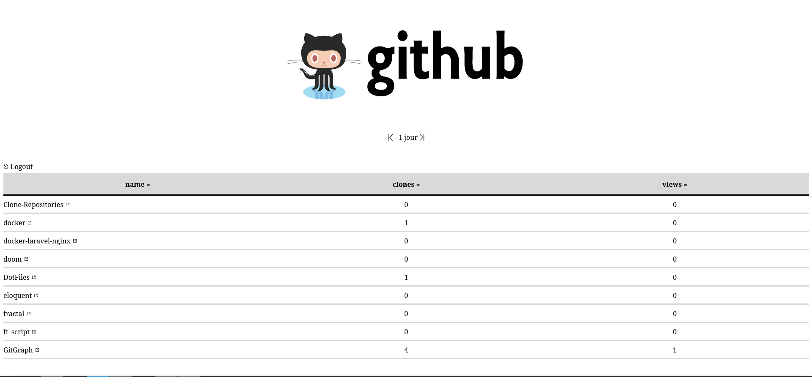

# Github traffic viewer

Get the traffic summary of your public github repositories. You can see : 

* referrer 
* unique clones
* unique views

> This is a full front-end application who simply rely on Github API as back. 

You can see it at [gitgraph.wellsguillaume.fr](https://gitgraph.wellsguillaume.fr).

It also rely on a PHP server who handle the authentication process. This is a docker container that you can find : [here on dockerhub](https://hub.docker.com/r/waxer/gitgraph) with his dockerfile : [here](https://github.com/Bulliby/docker/tree/master/gitgraph)

## Installation

* `npm install`
* `npm run build_prod`
